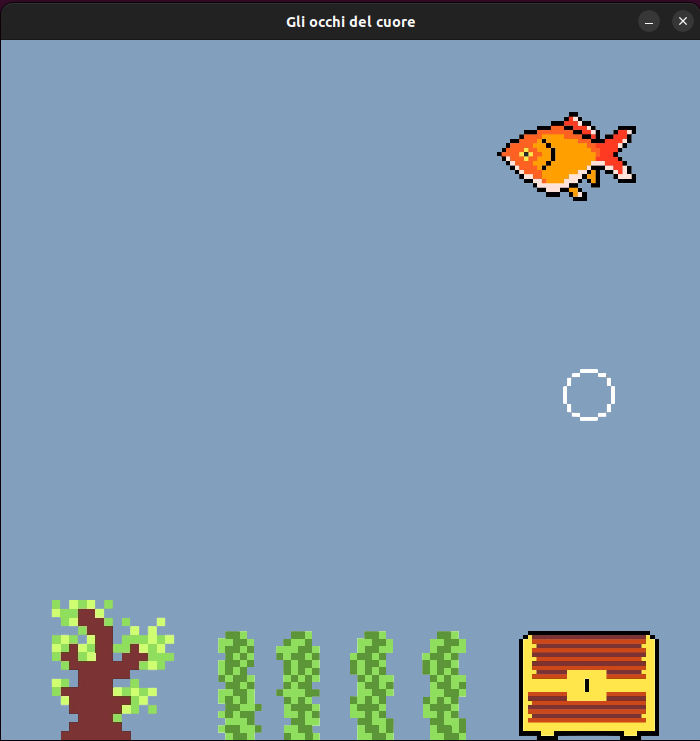

# Boris

Questa routine è fatta per omaggiare la serie TV "Boris" e ti permetterà di avere sullo schermo un pesciolino rosso ispiratore, in modo da poter produrre monnezza al meglio come il grande Renè Ferretti.

## Dipendenze

Le librerie necessarie per compilare il codice appartengono tutte alla libreria SDL2; se non la hai già installata, puoi farlo seguendo [queste istruzioni](https://wiki.libsdl.org/SDL2/Installation "Link for SDL").

Se hai `apt` come package manager, puoi installare tutto il necessario con il seguente comando:

```bash
sudo apt install libsdl2-2.0-0 libsdl2-image-2.0-0 libsdl2-mixer-2.0-0 libsdl2-ttf-2.0-0
```

## Esecuzione

Per compilare ed eseguire il programma, basta digitare il seguente comando (dopo aver installato le dipendenze e gcc se non è già presente sulla macchina):

```bash
./compile_and_run.sh
```

Durante l'esecuzione, puoi premere i seguenti comandi per attivare le seguenti funzionalità:

- "C": pulisci l'acqua. Nel tempo, la boccia si sporca e l'acqua diventa verde. Se non la pulisci per troppo tempo, muore! (e no, non puoi rianimarlo.)
- "F": nutri Boris
- "F4": basito
- "M": riproduci frase iconica #1: *monnezza*
- "S": riproduci frase iconica #2: *smarmella*
- "Q": riproduci frase iconica #3: *qualità*
- "A": riproduci frase iconica #4: *a cazzo di cane*

Qui sotto è riportata un'immagine del buon Boris che sguazza.



Buon divertimento e fatemi sapere se ci sono bugs o come si potrebbe migliorare!

> *NOTA*: in futuro verranno apportate le seguenti migliorie:
>
> - Boris apre la bocca quando respira/mangia
> - Nutrendo troppo Boris, morirà
> - Non nutrendo Boris troppo a lungo, morirà
